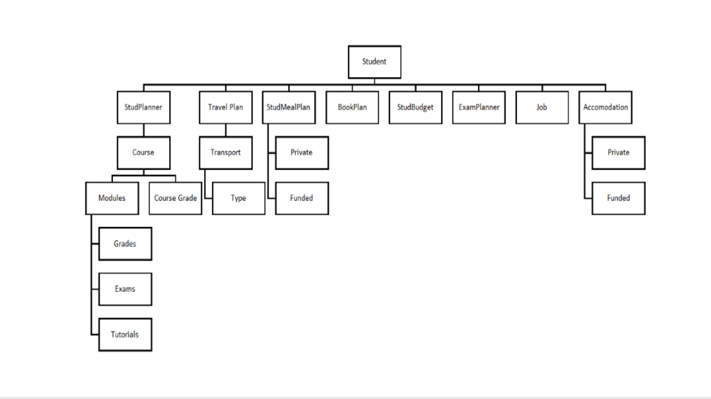

# StudentCompanionApplication_Mark_2
A application to assist students with there daily lives
Ismail Vardien

213180545

Class Group 3G

Application Development 3

Problem Domain

I have chosen a student companion app that will allow students to plan their day, budget their expenses and for those who travel by train it will allow them to view the available trains as well as the trains that are delayed to find another way to travel or another train to take to get to campus.

Travel, time management and budget are among the main problems that students face. Students find it hard to travel to campus via trains as a train can be delayed or cancelled so a student would have to find a different way of transport or wait longer for a train to arrive and most times students only find this out when they reach the train tracks and speak to the clerks at the station.

When students plan their expenses they normally do not account for most things. The application will allow students to input an expected budget for a current month and plan for change by entering expenses and subtracting it from the budget which will alert the student to changes to budget that is required and how much money would be required for the month

The planner will allow students to enter their classes in a calendar and what time they are which will remind the student to attend classes on time and remind them on which days a certain class takes place

